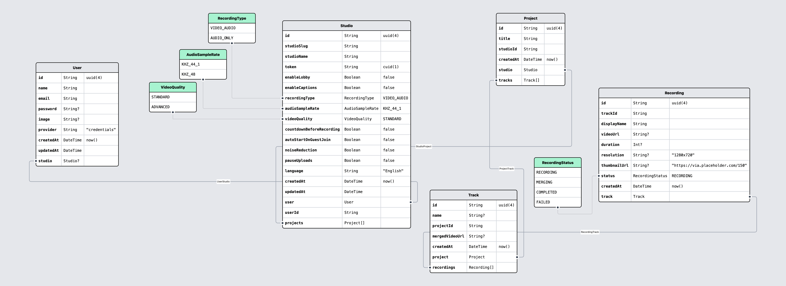

# audora-database



The database layer for **Audora** — a high-quality, studio-grade podcast and video recording platform.

Built with [Prisma](https://prisma.io), [PostgreSQL](https://www.postgresql.org/), and [Bun](https://bun.sh).

---

## 📁 Folder Structure

```bash
Packages/database
├── prisma/
│ ├── schema.prisma # Prisma schema
│ └── migrations/ # All migration snapshots
│ └── / # Individual migration folders
├── src/
│ ├── client.ts # Prisma client setup
│ ├── services/ # Modular service functions
│ │ ├── user-services.ts
│ │ ├── studio-services.ts
│ │ ├── project-services.ts
│ │ ├── track-services.ts
│ │ └── recording-services.ts
│ └── utils/
│ ├── slugifyStudioName.ts
│ └── generateMeetingToken.ts
├── package.json
├── tsconfig.json
└── README.md
```

---

## ⚙️ Scripts

| Script              | Description                                    |
| ------------------- | ---------------------------------------------- |
| `bun run generate`  | Generate Prisma client                         |
| `bun run migrate`   | Run dev migrations                             |
| `bun run reset`     | Reset database (drop, migrate, seed)           |
| `bun run db:deploy` | Deploy production migrations + generate client |
| `bun run studio`    | Launch Prisma Studio UI                        |

---

## 🧩 Exports

```json
"exports": {
  "./userServices": "./src/services/user-services.ts",
  "./studioServices": "./src/services/studio-services.ts",
  "./projectServices": "./src/services/project-services.ts",
  "./trackServices": "./src/services/track-services.ts",
  "./recordingServices": "./src/services/recording-services.ts"
}
```

⸻

📦 Requirements

```bash
• Bun v1.2.12+
• PostgreSQL 13+
• Prisma v6.7.0+
```
